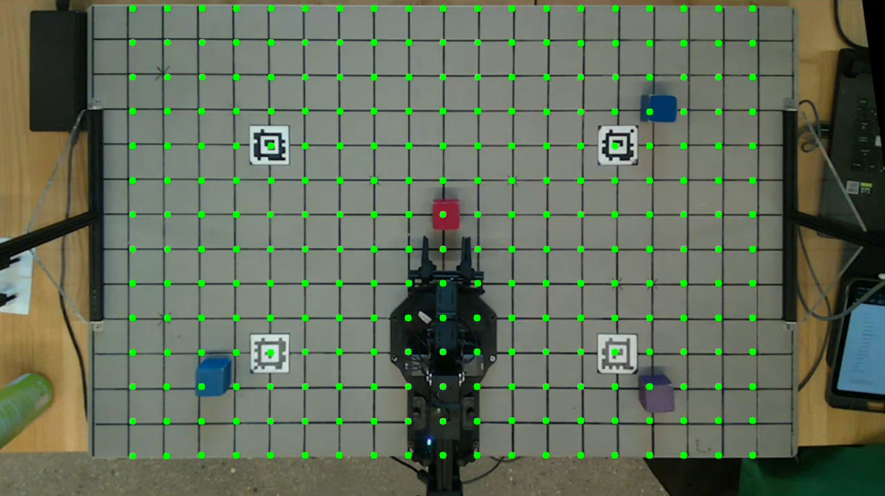
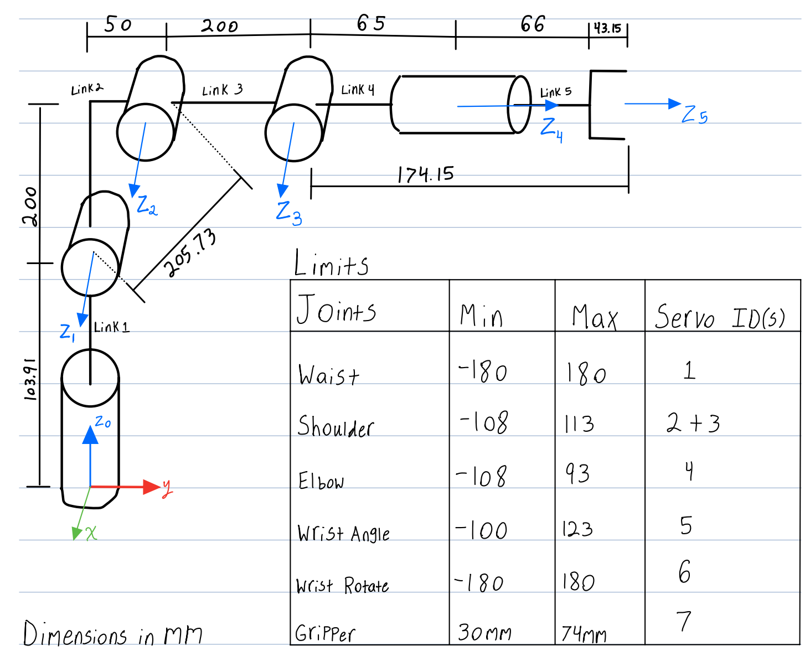

This project, developed for ROB550 – Spring 2026, focuses on building an autonomous 5-DOF ReactorX 200 robotic arm capable of detecting, grasping, and arranging colored blocks. The system integrates computer vision, kinematics, and motion planning to enable precise end-effector manipulation. 

##🧠 Key Features

### Computer Vision: Detects and localizes blocks using RGB and LiDAR camera with color-based segmentation.

The system uses an overhead Intel RealSense LiDAR camera to detect and localize blocks in the workspace. Images are first white-balanced and brightness-normalized to account for lighting variations, then converted to HSV color space to segment blocks by color. Contours are filtered to remove noise, allowing the robot to accurately determine each block’s position in pixel coordinates, which are then transformed into 3D world coordinates for autonomous manipulation.

###Calibration & Homography: Converts camera pixel coordinates to 3D world coordinates for accurate manipulation.

The camera is calibrated using intrinsic parameters and AprilTag-based extrinsic calibration to accurately map image pixels to real-world coordinates. A homography transformation corrects for the angled camera view, producing a top-down rectified workspace. This allows the robot to precisely locate and interact with blocks for grasping and placement tasks.

###Kinematics: Forward and inverse kinematics implemented for reliable end-effector positioning.

The robotic arm uses forward and inverse kinematics to translate between joint angles and end-effector positions. Forward kinematics calculates the end-effector pose from joint angles, while inverse kinematics computes the joint angles needed to reach a desired position. Together, these models enable the arm to accurately grasp and place blocks within its workspace.

###Autonomous Motion: 

The robot performs autonomous block manipulation using a three-stage motion sequence: approach, grasp, and retract. This strategy ensures stable and precise handling of objects, allowing the arm to reliably pick up blocks and place them in predefined configurations without manual intervention.

