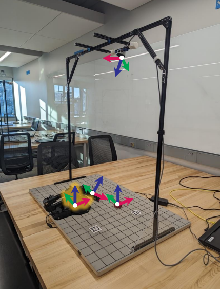
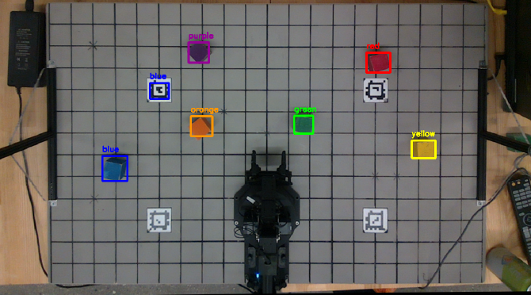

This project, developed for ROB550 – Spring 2026, focuses on building an autonomous 5-DOF ReactorX 200 robotic arm capable of detecting, grasping, and arranging colored blocks. The system integrates computer vision, kinematics, and motion planning to enable precise end-effector manipulation. 

🧠 Key Features

Computer Vision: Detects and localizes blocks using RGB and LiDAR camera with color-based segmentation.

Calibration & Homography: Converts camera pixel coordinates to 3D world coordinates for accurate manipulation.

Kinematics: Forward and inverse kinematics implemented for reliable end-effector positioning.

Autonomous Motion: Click-to-grasp sequences with approach, grasp, and retract stages for object handling. 

